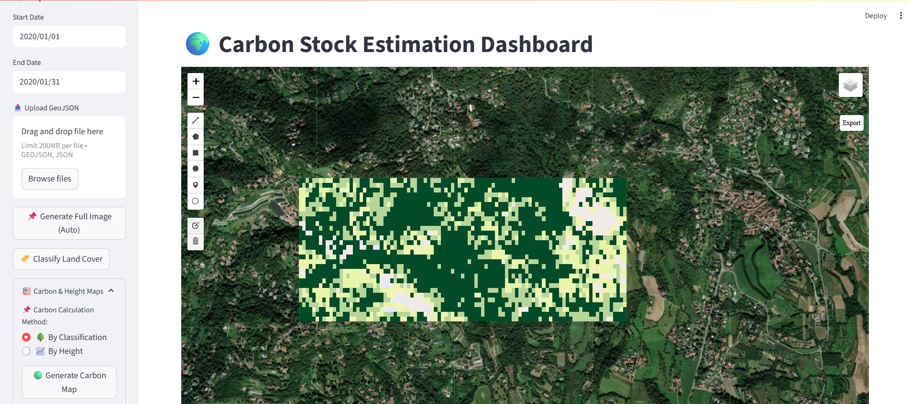

# SarviCa — Public Demo (Synthetic/Open Data)
Live demo: https://sarvica-app-demo.streamlit.app/

Minimal Streamlit demo that mimics SarviCa UI with NO proprietary code, models, or data.
It uses a demo service that generates small synthetic arrays so the app runs end‑to‑end safely.


 


## Quickstart
```bash
python -m venv .venv && . .venv/bin/activate   # Windows: .venv\Scripts\activate
pip install -r requirements.txt
streamlit run main_app.py
```

## Files
- `main_app.py` — Streamlit UI; tries to import `CarbonAPI` from `services` (private), otherwise uses `services_demo`.
- `services_demo.py` — Safe synthetic data provider (no GEE, no models).
- `requirements.txt` — Minimal runtime deps for the demo.
- `.gitignore` — Keeps data/models/secrets out of git.

## Disclaimer
This repo is a demo only. Production code, weights, and data remain private.
